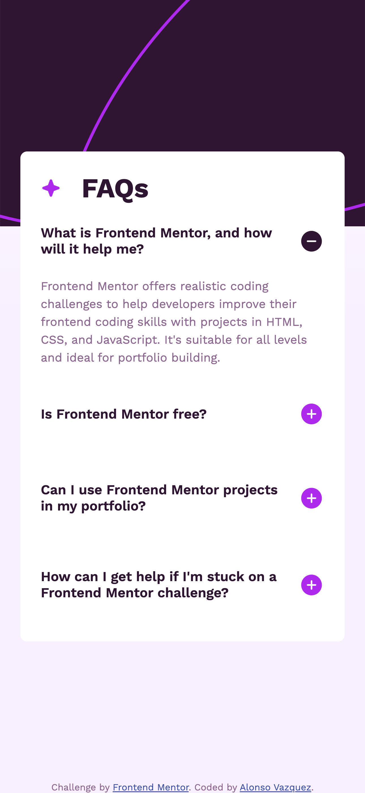

# Frontend Mentor - FAQ accordion solution

This is a solution to the [FAQ accordion challenge on Frontend Mentor](https://www.frontendmentor.io/challenges/faq-accordion-wyfFdeBwBz). Frontend Mentor challenges help you improve your coding skills by building realistic projects. 

## Table of contents

- [Overview](#overview)
  - [The challenge](#the-challenge)
  - [Screenshot](#screenshot)
  - [Links](#links)
- [My process](#my-process)
  - [Built with](#built-with)
  - [What I learned](#what-i-learned)
  - [Continued development](#continued-development)
  - [Useful resources](#useful-resources)
- [Author](#author)

## Overview

### The challenge

Users should be able to:

- Hide/Show the answer to a question when the question is clicked
- Navigate the questions and hide/show answers using keyboard navigation alone
- View the optimal layout for the interface depending on their device's screen size
- See hover and focus states for all interactive elements on the page

### Screenshot

### Links

- Solution URL: [Frontend Mentor](https://www.frontendmentor.io/solutions/flexbox-responsive-faq-accordion-k37iAUruku)
- Live Site URL: [Vercel](https://frontendmentor-faq-accordion-ten.vercel.app/)
- Repo URL: [Github](https://github.com/alonsovzqz/frontendmentor-faq-accordion)

## My process

### Built with

- Semantic HTML5 markup
- CSS custom properties
- Flexbox
- Mobile-first workflow

### What I learned

Working on this challenge help me to work with more semanctic HTML5 elements which actually helped me to also understand and make sure that what I'm using is already accessible.

The use of Javascript was just to keep consistency to add some "aria" attributes and find a small workaround to toggle the icons to each summary. I realized that I can change the markers using CSS but the results were not as expected so I went for another different approach.

### Continued development

I'd like to continue improving my coding skills by recreating this challenge using a library or framework. But for the moment, I think I'm cool with this.

### Useful resources

- [MDN](https://developer.mozilla.org/en-US/docs/Web/HTML/Element/details) - MDN is always a good resource to follow and look for accesibility compliance. This specific page helped me to know how the `details` element works.

## Author

- Website - [Alonso Vazquez](https://www.your-site.com)
- Frontend Mentor - [@alonsovzqz](https://www.frontendmentor.io/profile/alonsovzqz)

